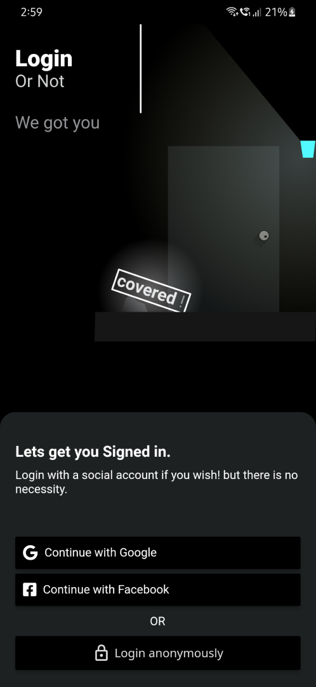

# SummarizeBuilds
This has public builds of summarize prototype. To check it out download the apk from release page

- Install the application on a mobile device
- Open application
- Login as anonymous (Google is restricted to summarize.dev accounts only)
    > 
- Choose dark theme instead of light (😅 light was kinda buggy when i working on it before)
    > 
- Click on the + button and then click on text button
- Enter any piece of text (upto a limit) in this case I will use
    > The first version of Flutter was known as "Sky" and ran on the Android operating system. It was unveiled at the 2015 Dart developer summit[8] with the stated intent of being able to render consistently at 120 frames per second.[9] During the keynote of Google Developer Days in Shanghai in September 2018, Google announced Flutter Release Preview 2, the last major release before Flutter 1.0. On December 4th of that year, Flutter 1.0 was released at the Flutter Live event, denoting the first stable version of the framework. On December 11, 2019, Flutter 1.12 was released at the Flutter Interactive event.[10]
    
    > On May 6, 2020, the Dart software development kit (SDK) version 2.8 and Flutter 1.17.0 were released, adding support for the Metal API which improves performance on iOS devices by approximately 50%, as well as new Material widgets and network tracking development tools.

    From wikipedia about flutter

    > 

- Click on summarize and give the file a name.
- Explore the app now :)